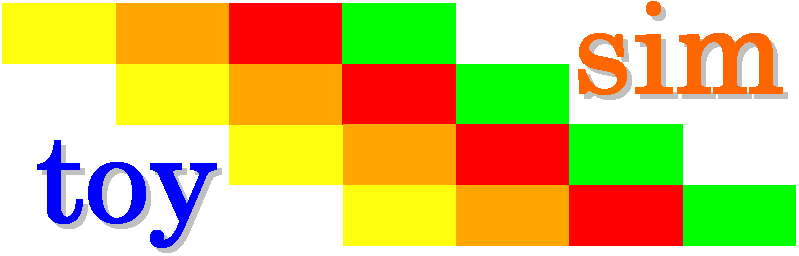

====================
 toysim user manual
====================

+-------------------+----------------------------------------------------------+
| **Title**         | toysim (ArchC functional simulator for the Princeton TOY |
|                   | machine)                                                 |
+-------------------+----------------------------------------------------------+
| **Author**        | Nikolaos Kavvadias 2010, 2011, 2012, 2013, 2014          |
+-------------------+----------------------------------------------------------+
| **Contact**       | nikos@nkavvadias.com                                     |
+-------------------+----------------------------------------------------------+
| **Website**       | http://www.nkavvadias.com                                |
+-------------------+----------------------------------------------------------+
| **Release Date**  | 02 December 2014                                         |
+-------------------+----------------------------------------------------------+
| **Version**       | 0.0.4                                                    |
+-------------------+----------------------------------------------------------+
| **Rev. history**  |                                                          |
+-------------------+----------------------------------------------------------+
|        **v0.0.4** | 2014-12-02                                               |
|                   |                                                          |
|                   | Added project logo in README.                            |
+-------------------+----------------------------------------------------------+
|        **v0.0.3** | 2014-11-02                                               |
|                   |                                                          |
|                   | Documentation corrections.                               |
+-------------------+----------------------------------------------------------+
|        **v0.0.2** | 2014-10-30                                               |
|                   |                                                          |
|                   | Project cleaned-up and updated for Github.               |
+-------------------+----------------------------------------------------------+
|        **v0.0.1** | 2010-12-11                                               |
|                   |                                                          |
|                   | First public version.                                    |
+-------------------+----------------------------------------------------------+

.. _TOY: http://introcs.cs.princeton.edu/java/50machine/
.. _`TOY reference card`: http://introcs.cs.princeton.edu/java/53isa/cheatsheet.txt

1. Introduction
===============

This is the ArchC (http://www.archc.org) functional simulator model for the 
Princeton TOY_ processor. The Princeton TOY machine is a 16-bit educational RISC 
processor with only two orthogonal encodings. A description of the basic ISA is 
available in the form of the `TOY reference card`_.

This model has the system call emulation functions implemented, so it is a good 
idea to turn on the ABI option. It should be noted that this capability is 
currently untested.

2. File listing
===============

The ``toysim`` distribution includes the following files:
   
+-----------------------+------------------------------------------------------+
| /toysim               | Top-level directory                                  |
+-----------------------+------------------------------------------------------+
| AUTHORS               | List of ``toysim`` authors.                          |
+-----------------------+------------------------------------------------------+
| LICENSE               | The modified BSD license governs ``toysim``.         |
+-----------------------+------------------------------------------------------+
| README.html           | HTML version of README.                              |
+-----------------------+------------------------------------------------------+
| README.pdf            | PDF version of README.                               |
+-----------------------+------------------------------------------------------+
| README.rst            | This file.                                           |
+-----------------------+------------------------------------------------------+
| VERSION               | Current version of the project sources.              |
+-----------------------+------------------------------------------------------+
| defines_gdb           | Macro definitions for GDB integration.               |
+-----------------------+------------------------------------------------------+
| modifiers             | Instruction encoding and decoding modifiers.         |
+-----------------------+------------------------------------------------------+
| rst2docs.sh           | Bash script for generating the HTML and PDF versions |
|                       | of the documentation (README).                       |
+-----------------------+------------------------------------------------------+
| run_tools.sh          | Script for automating the build of the simulator and |
|                       | the associated binary utilities (``binutils``) port. |
+-----------------------+------------------------------------------------------+
| toy.ac                | Register, memory and cache model for TOY.            |
+-----------------------+------------------------------------------------------+
| toy_gdb_funcs.cpp     | GDB support for the TOY simulator.                   |
+-----------------------+------------------------------------------------------+
| toy_isa.ac            | Instruction encodings and assembly formats.          |
+-----------------------+------------------------------------------------------+
| toy_isa.cpp           | Instruction behaviors.                               |
+-----------------------+------------------------------------------------------+
| toy_syscall.cpp       | OS call emulation support for TOY (untested).        |
+-----------------------+------------------------------------------------------+
| toysim.png            | PNG image for the ``toysim`` project logo.           |
+-----------------------+------------------------------------------------------+
| /tests                | Tests subdirectory                                   |
+-----------------------+------------------------------------------------------+
| run-tests.sh          | Run a selected benchmark.                            |
+-----------------------+------------------------------------------------------+
| /fibo                 | Fibonacci series benchmark directory                 |
+-----------------------+------------------------------------------------------+
| Makefile              | Makefile for building the benchmark.                 |
+-----------------------+------------------------------------------------------+
| ac_start.s            | Startup file (prior main()) for TOY.                 |
+-----------------------+------------------------------------------------------+
| fibo.asm              | Fibonacci benchmark using the alternative Princeton  |
|                       | TOY assembly syntax (defined for the ArchC model).   |
+-----------------------+------------------------------------------------------+
| /popcount             | Population count benchmark directory                 |
+-----------------------+------------------------------------------------------+
| Makefile              | Makefile for building the benchmark.                 |
+-----------------------+------------------------------------------------------+
| popcount.asm          | Population count benchmark using the original        |
|                       | assembly syntax (needs to be converted).             |
+-----------------------+------------------------------------------------------+

3. Usage
========

To generate the interpreted simulator, the ``acsim`` executable is ran::

  $ acsim toy.ac [-g -abi -gdb]       # (create the simulator)
  $ make -f Makefile.archc            # (compile)
  $ ./toy.x --load=<file-path> [args] # (run an application)

To generate the compiled application simulator, the ``accsim`` executable is 
ran::

  $ accsim toy.ac <file-path>         # (create specialized simulator)
  $ make -f Makefile.archc            # (compile)
  $ ./toy.x [args]                    # (run the application)

The ``[args]`` are optional arguments for the application.

There are two formats recognized for application <file-path>:

- ELF binary matching ArchC specifications
- hexadecimal text file for ArchC

In order to generate the binary utilities port (``binutils`` port), the 
``acbingen.sh`` driver script must be used. This should be called as follows::

  $ acbingen.sh -atoy -i`pwd`/../toysim-tools/ toy.ac

for generating the ``binutils`` port executables. This includes the following 
tools:

- ``addr2line``
- ``ar``
- ``as``
- ``c++filt``
- ``gdb`` (the GDB port is also generated in the same directory)
- ``gdbtui`` 
- ``ld``
- ``nm``
- ``objcopy``
- ``objdump``
- ``ranlib``
- ``readelf``
- ``size``
- ``strings``
- ``strip``

4. Notes
========

The assembly instruction syntax followed by the ArchC-based simulator for TOY is 
quite different than the original syntax. The following table summarizes the 
differences of the two syntax variations.

+------------------------------------+-----------------------------------------+
| Original syntax                    | ArchC-compatible syntax                 |
+------------------------------------+-----------------------------------------+
| ``R[d] <- imm8``                   | ``lda rd, imm8``                        |
+------------------------------------+-----------------------------------------+
| ``R[d] <- mem[imm8]``              | ``ld rd, imm8``                         |
+------------------------------------+-----------------------------------------+
| ``R[d] -> mem[imm8]``              | ``st rd, imm8``                         |
+------------------------------------+-----------------------------------------+
| ``R[d] <- mem[R[t]]``              | ``ldi rd, rt``                          |
+------------------------------------+-----------------------------------------+
| ``mem[R[t]] <- R[d]``              | ``sti rd, rt``                          |
+------------------------------------+-----------------------------------------+
| ``R[d] <- R[s] + R[t]``            | ``add rd, rs, rt``                      |
+------------------------------------+-----------------------------------------+
| ``R[d] <- R[s] - R[t]``            | ``sub rd, rs, rt``                      |
+------------------------------------+-----------------------------------------+
| ``R[d] <- R[s] & R[t]``            | ``and rd, rs, rt``                      |
+------------------------------------+-----------------------------------------+
| ``R[d] <- R[s] ^ R[t]``            | ``xor rd, rs, rt``                      |
+------------------------------------+-----------------------------------------+
| ``R[d] <- R[s] << R[t]``           | ``shl rd, rs, rt``                      |
+------------------------------------+-----------------------------------------+
| ``R[d] <- R[s] >> R[t]``           | ``shr rd, rs, rt``                      |
+------------------------------------+-----------------------------------------+
| ``R[d] <- pc; pc <- imm8``         | ``jal rd, imm8``                        |
+------------------------------------+-----------------------------------------+
| ``pc <- R[d]``                     | ``jr rd``                               |
+------------------------------------+-----------------------------------------+
| ``if (R[d] == 0) pc <- imm8``      | ``jz rd, imm8``                         |
+------------------------------------+-----------------------------------------+
| ``if (R[d] > 0) pc <- imm8``       | ``jp rd, imm8``                         |
+------------------------------------+-----------------------------------------+
| ``pc <- pc``                       | ``halt``                                |
+------------------------------------+-----------------------------------------+

Supported pseudo-instructions include:

- ``nop`` (no operation)
- ``move`` (move register)
- ``neg`` (negate)
- ``li`` (load immediate)
- ``la`` (load address)

5. Prerequisites
================

- ArchC installation (tested on Cygwin/Win7-64bit and Linux)
- Standard UNIX-based tools: ``make``, ``gcc``.

6. Contact
==========

You may contact me at:

|  Nikolaos Kavvadias <nikos@nkavvadias.com>
|  Independent Consultant
|  http://www.nkavvadias.com
|  Kornarou 12 Rd,
|  35100 Lamia, Fthiotis
|  Greece
